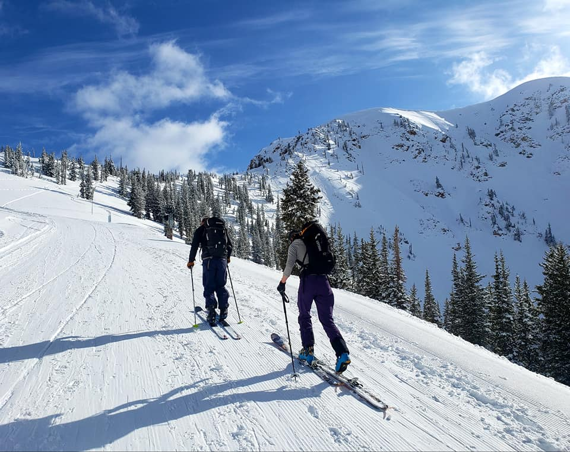
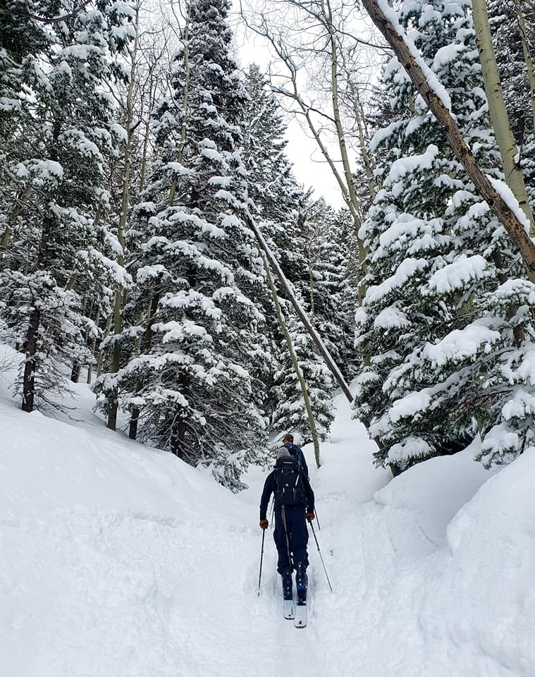
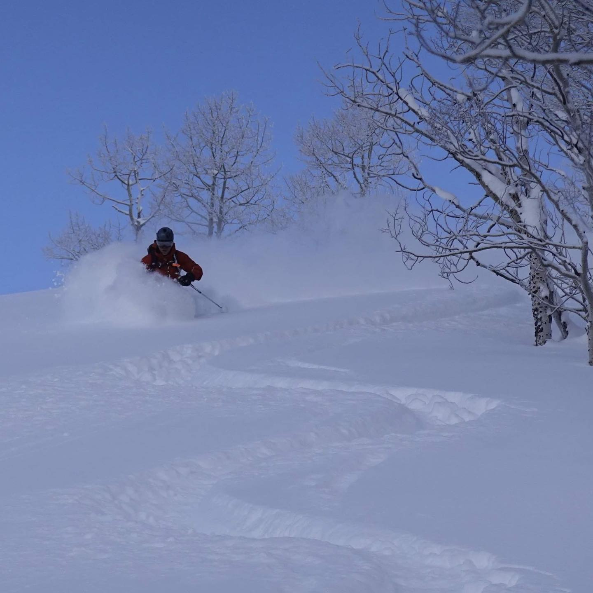

Well, that's a wrap!   

This whole ski season was a blur for me:  Lots of good inbounds days,  lines longer than I have ever seen, tons of tours on mostly low angle, safe slopes considering the extreme danger and horrible condition our snowpack was in for most of the season.  

We saw more deaths due to avalanches in the Rocky Mountains than any other year on record. There was a few weeks where almost daily we saw news out of Colorado, or Wyoming, or Utah of groups of skiers getting caught.  

Here in Utah we had a man die on Dutch's Draw off 9990 chair at PCMR/The Canyons area. Just out of bounds.   A few days later another man, same angle, same area, died on Square Top.  Then a group of young kids died in Millcreek, skiing very low angle, mostly 30 degree stuff.  The extreme "black rose" on the [uac](www.utahavalanchecenter.com) site was a rarity I have never seen in 16 years of being in Utah. 

I lost count how many days in the backcountry I had. A lot of dawn patrols, some dusk patrols, and skipping the massive crowds for the solace of the skin track.   A few of the guys in my group yearned for the big and steep lines abundant in the Wasatch but had to play it safe and ski the traditional Grizzly Gulch, Emmas, Cardiff, BearTrap zones.  It got a little redundant but at least it wasn't deadly. 

IKON and Epic truly has knocked the resorts for a loop.  With the combination of traffic, congestion, lift lines not squeezing everyone together, mask mandates and more and more people moving to Utah, All the ski resorts  from PC to LCC are at their bursting point for capacity.  

Locals are grumbling, Alta will be charging non-season pass holders and even those that want to BC ski up Emmas or Grizzly Gulch will have to pay to access their own public land.   It's a heated debate and one we will be watching.  There were times when the massive lines and traffic made me long for only a few years ago when Utah was still considered weird and not a good place to vacation and ski.  Those days are over, however, and we now have to accept that people from all over the world want to ski the Greatest Snow on Earth.   Pandoras Box is indeed open and we all need to figure out a way to make everyone happy.