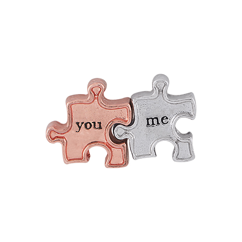

Have you ever been in a situation or relationship where it feels perfect at first?  People have used the jigsaw puzzle analogy a lot.  They always talk about how they "fit together like two puzzle pieces" only to find those pieces don't *exactly* fit together once the puzzle starts taking shape.  It feels foolish when you

Nothing is perfect. Sometimes those puzzle pieces can be fit together, or forced together, but once the puzzle is finished it doesn't fit in the picture.  It doesn't look or feel right.  What your brain or heart perceives as a perfect fit, over time, can be seen for what it really is.  We all make mistakes where attraction or whatever play a part.  Sometimes we really want those two pieces to fit together. Your family or friends or mutual hobbies may tell you they fit but you can see with your on eyes that they don't.