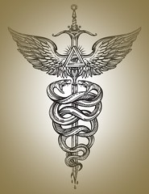

### Chapter 1

Me: "Man , I had so much fun with you last night. Thanks again for the amazing time."

(vague heart emoji reply)

Me: "Haha, yeah Let's do it again. I would love to take you out for dinner sometime this week"

Then...Nothing.  

Dating in the 2020's: You go out with someone you met on a dating app or Facebook.  They are intimate. They tell you secrets and why they are single, past loves who have jilted them and why they are the victim and not the victor.  You get just enough intelligent conversation, just enough eye contact and physical touch.  Maybe you get a kiss at the end of the night.

You think you've connected.  You think you made headway into someone's heart.  Maybe even a deeper feeling than that.  Then, the next day once the alcohol wears off they disappear.  

Was I too aggressive? Not aggressive enough? Not tall enough? Fit enough? Smart enough? Drove the wrong car? Didn't make enough money?

Then you realize that person was faking it.  They were suffering through your presence for whatever reason:  Attention. A Free Meal.  Dopamine. Sex.  To Feel Wanted.

We've all done it right?  We've all been the Rejected and the Rejector.  You don't feel like you owe that person any explanation You just met and had some drinks or dinner.  No need to be brutally honest and rip the band aid off. 

 No, it's better to not hurt feelings, right?  Do the "Slow Fade".  Tell them you need to work late all week and hopefully they get the hint.  If they don't then turn it on them:

"Hey what's up? I am getting the sense you aren't interested even though we talked all night and made out in my car.  I thought we had a connection?"

"Whoa. Really? Dude, I have been busy!  (insert undefendable excuse here to make you feel like the asshole.  Topics include: My Son Was Sick. My Dog Was Sick.  I Was Sick.  I Was Working.  I Was Out Of Service Even Though I Was Updating Social Media.  My Phone Broke. I Was In An Accident)."

See? Now you are the asshole and they can move on knowing they are good people.  You have become part of the narrative of their next date.  You get a title and a nickname for their friends.

That's ok.  Pick yourself up and dust yourself off.  You have other fish in the sea.  You have a line of men or women waiting to meet you.  It's no problem to stay shallow and date in this world, even during a pandemic. If you look good you will get dates. Period.  There is no need for intellect or empathy.  

Swipe right. Connect. Disappear. Repeat. Sometimes you are the Victim and sometimes you are the Victor.

## \-------------

## Chapter 2

I toss and turn.

She lies next to me, mumbling into the pillow. Everything she is saying to me makes me irritated and angry.  She just wants to know if we are ok. 

"Is everything ok with us?  Are you ok?"

I get up. I am short with her: "If you keep asking me this every other day you should just go home. I don't go for this needy, clingy shit!"  

"Babe, why are you being like this?" she cries, confused.

I storm out of the room.  I go and try to sleep on the couch. She follows me and stares at me with sad eyes. It makes me more upset. I am pissed and I don't really know why.

Inside I am raging.  I am so irritated with her. We've been together for a little over a month.  We already took a road trip to San Diego and surfed every day.  We've camped in the back of my truck.  We rock climb.   She loves most of the things I do. She skis and snowboards and is a ski patroller and part time actress.  She loves my music and plays ok guitar.  She checks all the boxes for me.  She's goofy and kind and tall and blonde and pretty.  So what is my problem?

## \----------

## Chapter 3

Everyone I know who is single has ADD.  Everyone is looking for *perfection*.  Everyone is so fragile and needy and yet have walls up so high.  We all want our needs met but won't budge when it comes to actually giving something back.  

We go on dating apps, we tell our stories over and over to strangers. We wear our false-hearts on our sleeves to appear sensitive.  Our lives on Instagram are *amazing. ah-mazing.* Everything is *blessed*, and I am *woke*, and  I just need to find my *Forever Person*.

In reality we hide our true hearts behind barbed wire.  It's there, beating away.  Try and touch it and you see it's protected behind angry words and fake emotion and trenches of shallow connections.  Try to pull it out into the light and watch me bite and snarl and defend my fragile ego. 

I am numb. I don't want to be touched but In my head I replay bad 80's romantic comedies.  I yearn for deep, meaningful connections.  I don't want to give anything away or drop the facade of happiness but inversely I want her to open up, unconditionally, like a flower in spring. 

Tell me everything. Let me feed off of you.  I'm a parasite.  I want you to want me, like the Cheap Trick song.  

I want you to worship me but don't get too close. 

Don't expect anything in return.  

I am not the guy you see on stage, or joke around with on a chairlift , or have a beer with in the bar.  I'm kind, but I'm also kinda not.  I'm selfish but I can pretend to be empathic with words of praise and distractions.  Eye contact and a shoulder to cry on.  I mean well, really I do.  I want to be That Guy.  I am Harry, you are Sally.   

We laugh and joke and talk about our past affairs and how this one or that one really fucked me over but it has taught me things. Life lessons, ya know? Heartbreak is real and necessary for growth.  

She was a crazy bitch who wrecked me this way or that way.  It's not me. It's never me. It's always the Other Person.  It's never my decision.  How could she want me to pay for everything and get mad when I ask her where my truck is she's been borrowing to drive around with for a week?  It's not like I saw that coming!

\---------

## Chapter 4

I pick relationships that are doomed to fail: the stripper with all the stereotypical stripper tendencies and addictions, the groupie who is 20 years younger than me with Daddy Issues, the Long Distance relationship, the Narcissist, the Emotionally Detached, Not-Ready-Freshly-Divorced, the Disappearing Woman, the Cheater, the Not-My-Type-But-Looks-Good-On-Paper-And-My-Mom-Would-Love-Her, the Bisexual, the Polyamorous-Woke-Hipster.  

I set it up, I convince myself This Could Be It, then when it ultimately fails I move on quicker than a crack addict picking up a nickel.   I push it all down. Deeper and deeper.

 I honor my Boston Italian and Irish heritage.  I can almost hear every dead male ancestor cheering from their graves.  

Show no emotion. No weaknesses in the armor.

\-------------

## Chapter 5

I knew Sarah for years and she was recently separated from her husband. She is in phenomenal shape. A person trainer obsessed with fitness, diet, supplements, her body.  

We met for coffee and she told me how she cheated on her husband with some rich asshole and she felt bad because she didn't feel quite so bad about it.  He was a *connection* she has never felt.  Something inside of me clicks. My brain and heart goes there.  Instead of seeing this gigantic red flag I see possibility.  As in: if she cheated with this guy, she could cheat with me too!

 A month or two later she is separated and living in her own place. She has a party. I go. We drink. We make out. We eventually hook up.  Spiraling down this rusty drain, knowing there is no shot but holding out hope that Love Will Overcome.  It will make a great conversation starter for our grandkids someday. 

Fleeting love.  Shallow connections.

Harry. Sally.  I am playing Peter Gabriel  out of a boom box at her window.  

I know not-so-deep-down that it's doomed.  A friendship ruined by her need for attention and to feel loved by a man again, and my need to have a fit , hot, slightly popular girlfriend who is great in bed and gets my movie references.  

Little did we know, it grew.  We actually really like each other. Walls started to come down. The humor, the long talks, the bike rides, the early morning workouts, taking edibles and lounging on the couch watching Netflix, and the sex. Her friends approved, my friends approved, we had to hide all of it in this little ski town where everyone knows everyone and gossip spreads faster than Covid-19. 

Ultimately one day after four months of deeper and deeper connections, of talks of moving in together and What Could Happen Next she tells me she is going back to him.  

"For the kids" she says.  

Not for the massive amounts of money she will stand to lose in the divorce. Not for the fact that she would have to work again and didn't have much of a career.

 "For the kids. I can't let them be out of my sight for fear I may lose them to hate and Fox News and red MAGA hats that their father adorns."

How do i even argue with that?  How do i defend my position or convince her otherwise? How do I get her to pick me over her kids, money, stability, a husband who doesn't cheat but treats her like shit?  A boring future locked away in a gilded cage, surrounded by money and fake friends and attending cocktail parties for pharmaceutical reps in exotic locations?  

The answer is : I don't.  

Let it go man. Let it go. Move on. 

Instead I rail against her like we never crossed that Rubicon. Like she didn't already make the decision to move back in. I cry she didn't even consult me yet she owes me nothing.  

My opinion doesn't matter.  Nothing stands between a mother and her cubs, I told myself.

I fire a text at her, "I hope you enjoyed your vacation.  Mark my words: one day you will be in your nice big kitchen staring out the window knowing you had real love and you blew it. You threw happiness away for money in this dead marriage where this guy just talks to you like you're an idiot and an asshole."

But it's too late.  She's gone.  I'm screaming into a void.

Later she tries to maintain and repair our friendship via Likes on Facebook and making silly little one line comments on pictures I post.  Little flitting waves across the room. I ignore her.  I embrace the Victim Role with open arms.

\---------

## Chapter 6

I keep telling myself I just got out of a hard relationship with someone I thought I loved.  I am fucked up because of that.  I am rebounding. I allow myself some sadness and a night of hard drinking and self pity.  I need attention from a beautiful woman.  I need to use someone. I need to fill this hole. To duct tape it until it stops breathing. 

I met Stephanie two weeks later. 

I saw her picture on social media and made a comment. Something about rock climbing in an area I have climbed before.  This lead to a very rapid PM conversation and we both agreed we should meet right away.

On my birthday.  

We drank. I forgot all about Sarah., or should I say Sarah was always right there lingering in the background of the conversation.  I have flashes of her finding out I'm out with this much younger, wide-eyed pretty girl and being so jealous.  I drank some more. 

We camped together that weekend. Then we went to San Diego on a whim. I picture Sarah sitting at her kitchen table looking at my pics of me surfing in San Diego. The ocean, the sand, me smiling into the camera. 

I am so happy, everything is great and easy and fun.

When the trees of negativity have sprouted in my heart and the doubts and fears of being ripped apart again are still fresh in the roots I plow forward and charge the barriers. 

I hope I don't hurt her. She is a good person:  a kind but tough Ohio girl who lost her dad slowly due to a stroke.  She is living her Best Life. She is following her dream but sort of trying to keep her head above water while being dragged by the currents of life and realizing Ski Patrol doesn't pay the bills.   It's scary and fleeting and hard on the body and she knows it but she loves it and I respect and honor that. It's brave and tragic and beautiful.

## \---------

## Chapter 7

Before Sarah and Stephanie I went through a winter of getting over a failed marriage that lasted two weeks. 

Yes. Two weeks.  

I was living in Boulder and I met Mary on a dating app.  We instantly attached ourselves to each other.  Two vipers wrapping around each other emotionally like the snakes in  the Caduceus. A malignant Borderline Personality Disorder meets a Fragile Needy Empty Soul.   A match made in heaven.

We were the same age, we had similar hobbies, she looked great naked.  We did yoga together and walked the dogs. We both loved the Grateful Dead and I would play Althea for her on the guitar and she would correct the lyrics for me.  Mary lived in the hills above Boulder in a cabin. We would sit out on her porch and watch the bikers climbing slowly up Left Hand Canyon while drinking coffee and talk about our future.  I never met anyone like her and was instantly hooked.  She followed the Dead and moved to Breckenridge to learn how to snowboard in the 90s.  She had tattoos. She was exotic.  She wanted to learn how to surf and live in Costa Rica.  She knew she had me and so we did what every Gen X'er would do: we bought a real expensive house together and moved in together almost immediately.  

In hindsight everything was so wrong and rushed and crazy.  I kept telling myself "When you know, you know". I mean, my step father and mother moved in together almost immediately too and I admire their relationship and their love to this day.  They have been going strong as the head of the family for 35 years and still laugh daily.  I want that. I can have that.  With her. 

For most of the winter it all went ok although she really wasn't as into snowboarding as i was lead to believe.  Also she had no desire to meet my friends or come to Utah to see me play with my band (I was going back once a month to play gigs in Park City) or ski at all in Utah.  She also, alarmingly, still did acid with her friends which i found bizarre and hurt my brain to even think about.  I gave up psychedelics after I had a bad trip on mushrooms in college and I sometime think that they affected my brain permanently. I definitely partook in acid and mushrooms in college and had my fair share of Dead shows and long walks in the woods tripping on God knows what. 

On the eve of our one year anniversary of meeting we went to the bar we met at and she proposed to me.  A few weeks later we were married.  We had a little dinner with mostly her friends, my parents, and two of my friends.  

"You two look so happy" everyone gushed.  Yet, there was an air of Something Not Right at the dinner table that night that my mother was picking up on.  She recalled later that Mary's friends all looked at me with sort of pity.  Maybe that's not the right word.  They were maybe "concerned" that I didn't know the whole truth. 

At the time we were in the middle of buying a place in Nosara, Costa Rica.  The dirt roads, the surf, the sand, the yoga, the locals. It was Heaven.  My dream of leaving the corporate bullshit of software engineering and owning a little coffee shop in the jungle was palpable.   It was going to be our dream home and escape from the insanity and divisiveness of  the United States.  Our future would be Pura Vida.  Old snowboarders don't die, they take up surfing. 

She was selling her place in Boulder, I was selling my place in Park City and taking money out of retirement to make it happen. Despite a good position in the software industry I am not "rich" by any means. Both of us coming from single mom upbringings in blue collar environments, I am very bad with money management.

We were supposed to close on this little Spanish adobe five minutes from the beach on July 3rd of that year.  She was going down to handle the closing of the house and I was staying to take care of the house in Boulder and feed the fur babies. She was going to paint the place and get some furniture and get a company to handle gardening and security etc. 

This is a very important date to remember: July 3rd.

Two weeks later it all came crashing down. 

## \------------

## Chapter 8

That weekend Mary and I had a fight and I was getting the proverbial cold shoulder all weekend. My step-father (a clinical psychologist for most of my life) explained to me later she was classic BPD and playing the victim and abandonment issues where par for the course.   

I do realize now how she surrounded herself with people who were givers. Her friends mostly doted on her and she played the role of victim with them very well. I recall her needing to take a sled down at Breckenridge because she had an "asthma attack" despite two doctors telling her she didn't have asthma. Side note: who takes the sled down for an asthma attack anyways?  In ski culture taking the sled is reserved for Jerrys or for only when you are really really hurt...but  I digress. 

The reason for this Cold Shoulder was after her usual 1.5 hour power hot yoga class she had another "asthma" attack and wanted me to come and get her at the studio. Despite having a car and an inhaler and a place to rest and me being home about 45 minutes away, she insisted I come and get her. I had trouble hearing her as she told me this as I was speaking to her while driving up Lee Hill Road.  

Now, anyone who knows Boulder, CO and Lee Hill Road knows it's a very steep,  beautiful, well known road for road cycling but you instantly lose service when you turn onto the road.  

She keeps cutting and out of service, "What babe? What? hold on? Shit, I JUST got up Lee Hill, I was waiting for you in Boulder to see if you wanted to have a beer or something after yoga. What? Shit, I cannot hear you, let me call you back when i get home and into service."

Five minutes later I call and she says coldly the she is *fine*. Everything is *fine*.  Her girlfriend  is there and they are going out for drinks. She is there for her, undertones of accusations of me abandoning her, and everything is *fine.* 

Mary didn't come home till late that night and had beers with her friend. Oh,  and two guys from yoga who just happened to show up at the same bar.

The guys they happen to meet at the bar was so *interesting,* she tells me*,*  and he was there for me, Corey.  He was there for me.  He checked on me when I had trouble breathing at yoga and checked my pulse and told me I should probably have a beer with him because it will help the asthma. 

Cracks in the foundation.  Red flags popping up in my head.  I don't care. We just got married. This is what i want. Why is she saying these things? Why is she doing this? She's my wife, why is she going out for beers with guys from yoga?

Even the dogs looked at me like I was getting played the fool.

As fate would have it, I lost the job I hated at Large Corporation two days later.  I lost it partly through manifestation, partly from backstabbing by an overly ambitious junior programmer who wanted my job.   Either way I knew I would be fine. I did work in IT after all.  I was a senior level developer with tons of experience, even though I hated the business. Boulder was a hot spot for IT and I had offers within days.  

I came home that day and told her I lost my job.  She told me I should go skiing at A-Basin.  

"It will help" , she said.  

"Thanks babe, you really are amazing." I crooned. Forgetting the frigid woman I was dealing with all weekend.

The next day I went skiing alone. I sat at the bar at A Basin wondering about my life.  Between jobs, a new marriage, a house in Boulder, a condo in Park City that was under contract and whose proceeds were going to the house in Costa Rica. She calls me furious that she had to clean the floors in the 300 square foot air b n b area in the basement.  

"Why didn't you clean this? I just wanted you to do ONE THING. To help me with this! Why didn't you do this?"

I was stunned. 

"You told me to go skiing. I went skiing. What is your problem?  I made the bed and cleaned the bathroom and threw the trash.  Sorry I didn't mop the floor but I'm sure it took you about 20 minutes to do it. " 

On that day, sitting at the bar at A-Basin alone. Depressed and worried about life I saw the full Mary with the mask off.  She had me, she didn't need to pretend anymore.

I came home to a dark house as she was out celebrating the sale of her cabin with her friends.  

Because I was laid off from Large Corporation, they took away my laptop so I needed to use her mac to send out resumes.

I log in. 

I see her texts from her phone synced to her computer pop up.  I am not usually a suspicious person but something caught my eye:  multiple flame emojis from her friend describing a guy Mary met on Sunday night while she was out with her and my name mentioned.  

"Whoa, he was hot. a test huh?"

"Yeah he texted me last night!  Oofda!"

"I need to be debriefed!"

I can't, I'm so MAD at Corey right now"

"ohh, I need to be debriefed"

That was the exact exchange as I recall it.  Her single friend I took to calling Eeyore because she was always down about not finding the right man, using the term "debriefed"  like it's some kind of military situation: A Game. A War.

And here is my brand new wife chatting with her friend like two school girls over some guy she has been texting with.  A guy she exchanged phone numbers with two weeks after marrying me.  A random person, I come to find, she met at a sushi restaurant on Pearl Street.  

My heart sank.  My dreams crushed.  The wind taken completely out of my fucking sails.  The reality of it all is tumbling down.  The veil is being ripped off.

## \------------

## Chapter 9

I confront her when she comes home.

"We need to talk"  I say.

"Yes, Corey , yes we do" 

I think, "what the fuck does she have to say to me?"

"So, who is the hot guy you met at sushi Sunday night? Was it the dude from Yoga? Mr Sensitive Ponytail Boy whom you found so *interesting* and was *there for you* for beers Friday night*?*"  

Thoughts of me committing assault at our yoga studio on some dude flashed through my mind over and over while I waited for her. Convinced she was enamored with some random from yoga.  Some guy who knows she's married to me since our studio is a small community.  

She is stunned. Looks of disbelief.  A rat trapped in a corner.  Eyes darting for a way out. A lie. Something to say. No eye contact made, shoulders stiffened up. She did not know that I knew. 

"Oh, uh.. No, no baby. Not him. No. It was...this other guy. He was just walking by while Eeyore and  I were at the sushi bar and said "hey you look like you're having a great time!"  and I wasn't Corey, I wasn't.  But anyways, he and his friend joined us and he was just so *interesting*. He's an ex pro surfer who lives in San Francisco".

"um yeah there are lots of ex pro surfers who move to the Bay Area since the surfing is just so amazing at Alcatraz."

"Anyways, as I was walking out he asked for my number", She stammered.

"Did you tell him you are married and maybe you shouldn't give out your number?" I get within inches of her face.  I am staring her dead in the eye.  

"I want to see these texts between you. Right now, please."

I am numb. I am cold.  

I  grab her phone after I catch her staring at it in the kitchen possibly looking for some way out. 

Where is the delete button?  How do I delete these messages?  How? 

I see the messages.  She is the instigator of the conversation, not he.  She got his number and reached out to him.

"Hey it's Mary from (sushi emoji)"

"Oh i wouldn't have known it was you if it wasn't for the sushi emoji!  I had such a great time *connecting* with you. I almost missed my flight and would have had to stay at your place."

Ah, the single guy bringing sleeping arrangements into the conversation. An old trick I have used many times.  Like the velociraptors in Jurassic Park testing the electric fence, except he was looking for a way in, not out.  

"oh thats ok i have extra beds!"

"I" not "We". Extra beds? what the hell is she talking about?

She's flirting with him like she did with me when we met. The conversation continues. She stands in the kitchen, arms folded, staring at the floor. Hands caught in the cookie jar. 

"Oh, that's OK I will see you in Costa Rica on July 4th!"  She  texts back.

Clearly an arrangement has been made between the two of them. 

I stare at her in disbelief.

"How?  What the fuck? What is this?"

Her cold eyes stare down at the floor. The dogs stare at us, knowing not to bark. Knowing something is wrong.

"I wasn't going to follow through with it." she mumbles.

We have two airBnB renters in the basement.  I am furious. I want to scream at her and call her horrible names but I hold back, fearing the dreaded AirBnB review I would get.  So I am whispering directly about two inches from her face.

"What the fuck did you think was going to happen, Mary? huh?? What the fuck??"

"I will just sleep on the couch" she finally mutters.  Ignoring my increasingly frantic questioning. 

I am in in disbelief  standing in our kitchen in our beautiful house overlooking Boulder. Watching my new bride still in the Honeymoon Phase of the relationship grabbing pillows and blankets and making her way to the couch. I am stunned. I am numb.  I am suddenly so tired.  I just want to curl up and die, to scream, to hit her, to run away, to kick her out.  

I do none of these things.  

I go to our new bed we just got and try to sleep.  I stare at the ceiling and eventually fade away. 

## \-----------

## Chapter 10

The next day i get up to leave for Utah  as I was supposed to clean out my condo in Park City that was under contract whose proceeds were going to the Costa Rican house she was planning on fucking a stranger in.  She follows me outside at 5:30 in the morning.

"I will pay for the divorce and buy you out of the house. I've caused you enough heartbreak" She says coldly.  Flatly. No emotion.

She turns on her heels and runs back up the big flagstone stairs back to the house two at a time. 

"You fucking bitch!  Who the fuck are you? I don't even know who you are!" I scream at her as she retreats back to the house we purchased together, not saying a word. Not looking back.   The master is teaching the student how to be the Victim.

I drive the ten minutes down Lee Hill, trying to get to phone service to call my parents, to cry on their shoulders.  I need a coffee. I need to vent. I need to scream it all away. 

This is not happening.  This can't be happening.  Not to me.  This is shit you see in bad movies. Not my life.  

Who does she think she is? She just lost the best thing she ever could have. Why? To fuck a stranger?  How many other strangers was she fucking around with too?  Just because I caught her once doesn't mean it wasn't the first time. I pull over half way down. I'm hyperventilating.  I'm hysterical. I feel like vomiting.  My life is completely turned upside down. No job, a cheating wife, my dog, the house in Costa Rica, the condo in Park City. Round and round in my head.  

What am I going to do? What the fuck am I going to do?

### \------------

### Chapter 11

I'm standing in line at my favorite coffee shop. The one where the barista used to call me Chip since I looked a bit like Chip Gaines, the Home Makeover guy on tv.  I'm mumbling to myself, teary eyed, looking down, trying to distract myself from eye contact.  Groups of road cyclists sipping lattes and hipsters chatting in nooks, my barista smiles her big smile at me and immediately knows something is wrong.  I pretend to be ok.  She knows I'm not, but we are not friends, she is busy and definitely doesn't need to hear this, as juicy as it is.  I get my latte and leave the cute coffee shop for the last time. No more morning commute to Shitty Job, no more Saturday morning post-ride/post-yoga coffee.  I get in my car, I take a sip of my coffee and my heart explodes.  I was holding it together long enough to get my coffee. I had an eight hour drive ahead of me through I-70 ski country into the Utah desert and eventually Park City.  I had alot of time to think, to be alone.  

I wail.  It feels good. I open the window and let the Colorado air hit me full on in the face, wiping my tears away for me.  I blast down route 6 towards I-70.  The first of many trips I would take that month, culminating in me and a buddy in a moving truck with all my stuff moving back to Utah with my tail between my legs, no job, no home in Boulder, Park City nor Costa Rica.  

At the time I was so wrecked and so confused I remember pulling over right where route 6 can either turn right and eventually merge onto I-70 west, or go straight and merge on I-70 east.  I sit in the park n ride. All around me are skiers getting their shit together to carpool up I-70. Laughter, joking, conversations. Normal things around the hell inside of my truck.   

Let's see...

Turn left, drive three days to Boston.  See my family. Talk to my dad. Hug my mom.  Get my shit together.  All i have is a backpack with some clothes in it.  I could stop on Kansas City and have some ribs, stop in Nashville and listen to some music. Hit New York and get wildly drunk and throw all my cares into a bottle.

Turn right and take care of business.  Push it all down. Get it out on the drive. Ski my face off and obliterate all thought.  Push it down. Work. Get Shit Done. Move on with life.

I need to clean out my condo in Park City. It's under contract and will be sold in a month but they will understand right?  The single mom with two kids who bought my condo will understand and live in a La Quinta until I'm ready , right? 

I turn right. I call my parents. My mom immediately knows something is wrong.  I pour my heart out to her while driving through the Rockies.  

I pass the exit for Winter Park. I tell her about Friday night. I pass the exit for Keystone and A Basin and tell her about the fight we had, about her going out with her friends.  

By the time I pass Beaver Creek it is all out. I am drained. My parents are on speaker phone, stunned.  They were just in Boulder for the wedding two weeks ago.  How could this have happened? How? Everything was perfect. 

"It was all a lie mom. I got played"

My stepfather, ever the rational one, steps in with his calm psychologists demeanor and tone.  Everything will be ok. Let's break this down.  

He tells me about his thoughts on Mary and how she is classic [Borderline Personality Disorder](https://www.nimh.nih.gov/health/topics/borderline-personality-disorder/index.shtml).   

I take it all in. I take my dads word as gospel.  I harden my heart and plan for the future. I have to get divorced or annulled.  I have to move away. My head is spinning with a soup of emotion: hatred, anger, sadness, and yes optimism.

### Chapter 12

I go through the steps of depression.  The only solace I have is backcountry skiing. Throwing myself into a long tour and just letting my mind go to oblivion. The only way I know how to survive and to move on.  My friends look at me out of the corners of their eyes wondering if I am going to explode.  They don't need this.  We are all adults here, and American men in the 21st century are not the best at dealing with emotional wrecks. So, they do what they can. They feed me booze and food and get out of my way and just generally try to be there to help. I do my part and try not to randomly cry or scream at the sky.

I'm fine. Everything is fine.  I'm good.  Bullet dodged right?  Better to find out now than later, right?

I drink so much and eat so much bad food I get a gout inflammation. My foot feels broken half way up a ski tour. By the time I get to the car I cannot walk.  I'm more concerned that I am now stuck in a bed and with my thoughts than the pain I am in. I didn't even think gout was a real thing. That happens to fat guys who smoke, not me.   I have a job interview with a bank that I don't even want to attend but I do it anyways (and get the job somehow).  I start in two weeks.  

How?  I am living in my friends basement.  I can't even think straight. I keep waiting for this other remote job to offer me something so I can escape and hit the road.  I have money from the divorce since she bought me out for the house.  I could just run away.  Get in my truck and go.  

I don't.  I stay.  I start my new job.  Broken and confused and emotionally fucked up. I walk into this bank corporate office pretending to have my shit together.  I'm surrounded by the nicest people in the world (Mormons) and get the cheery "Welcome to the Bank"  orientation:  Here is your badge. Here is your credentials. Your computer. Your new coffee mug!  Your new headphones! The folder of papers describing the corporate policy and mission statement I will never read and end up in recycling.  

I somehow make it through the week.  I strive for the weekend. I need to get away. I am still on crutches from the gout.  Through the weeks and months the damage to my heart and mind slowly scabbed over. The scars are there and the walls are still high.  I subconsciously went back to the bad choices I have been making with my choice of a partner.  I blamed my location and my situation. Why would anyone want me?  I felt less than adequate and not able to contribute to a relationship, but I persisted nevertheless.  The thing is: I don't know how not to be with someone.  People always say you need to be alone after a hard breakup.  To process your feelings.  I envision going out to the desert alone with my thoughts but I never do that.  I stayed in the Fruita, CO desert when I decided to finally move back to Utah and there were tons of kids partying all around me. I had no solace and once i did i just felt lonely, angry and sad.  I am a people person. I have always been an entertainer both on and off the stage.  I thrive for the attention and the limelight (I admit it, I am a bit of a ham and cheese sandwich).  My mother always said I had two switches: on and off. I couldn't find the off button. I still can't find the off button. I threw myself into self destruction or entertainment. I wasn't me. I still feel like I am finding me.  The peace in my heart. But I don't give it a chance. Stay busy. Ski, play guitar, take acting classes,  get into bad relationships,  find bad partners! Mask it all with booze and weed. Run away.  Run, Corey. Run. 

\-------------------

### Chapter 13

Two years later.  

I wake up every night and I don't have to look at the clock: it's the Witching Hour.  I have to pee and I tell myself "don't think, don't think. Just relieve yourself and go back to sleep. Don't think." 

It's  always 3am when my heart and mind screams at me and I lie awake staring at the ceiling thinking about my failures when I am actually face to face with who I am.  I can't , or i should say "I shouldn't"  drink alcohol anymore as one beer or glass of wine causes me to wake up with a pounding heart and a painful throb.  I still go out and drink on doomed blind dates or social events because I am a slave to society and obedient to the norms.  

I am tired, I am calloused and confused. I am having a mid life crisis with my career choices.  I want out.  I want to run away. I still feel like I should have just ran two years ago.  I am taking acting classes dreaming of the silver screen.  I also try intermittent fasting, veganism and going gluten free .  I try to be conscious of my choices ranging anywhere from clothes to food to cleaning products. 

I feel like my life's calling is still somewhere just beyond my fingertips.  I believe we are here to love. To help each other up. To teach. To be taught.  To create. Karma.  I believe all these things. I read tons of books and listen to audio books on the subject of reincarnation ([Journey of Souls](https://play.google.com/store/books/details?id=Psk6tJq1ybQC&gl=us&hl=en-US&source=productsearch&utm_source=HA_Desktop_US&utm_medium=SEM&utm_campaign=PLA&pcampaignid=MKT-FDR-na-us-1000189-Med-pla-bk-Evergreen-Jul1520-PLA-eBooks_Catch_All&gclid=CjwKCAiA1eKBBhBZEiwAX3gql8_FHHCyoulWpydNlnn_P7bjw0eDDmlXOs3A5m64CKFbAQbu41hgDhoCHEQQAvD_BwE&gclsrc=aw.ds) and [Many Lives Many Masters](https://www.audible.com/ep/title/?asin=B002VACF28&source_code=GO1GBSH09091690EI&device=d&cvosrc=ppc.google.many%20lives%20many%20masters&cvo_campaign=250472289&cvo_crid=260134379685&Matchtype=e&gclsrc=aw.ds&ds_rl=1262685&ds_rl=1263561&ds_rl=1260658&gclid=CjwKCAiA1eKBBhBZEiwAX3gqlxaLwhkyu_wS08Yb3f-zch8edtkbAfygnljKOqU6J0zpcsSGh82AohoCY9cQAvD_BwE) are two of the best).  Basic Buddhism and spirituality.  

Now, I have always hated the dogmas of religion.  The idea of church freaks me out. The greed and perversions of the catholic church growing up in Boston has made me very anti-religion.  I hate the hypocrisy, the hubris, the holier-than-thou us vs them mentality of The Flock.  Living in Utah among the Mormons , with their smiling, glad handed hidden agendas, didn't help. I am an outcast in this society. Being silently judged behind fake smiles is something I can recognize well from growing up with a born again uncle and grandmother. I see it and it pushes me away further.