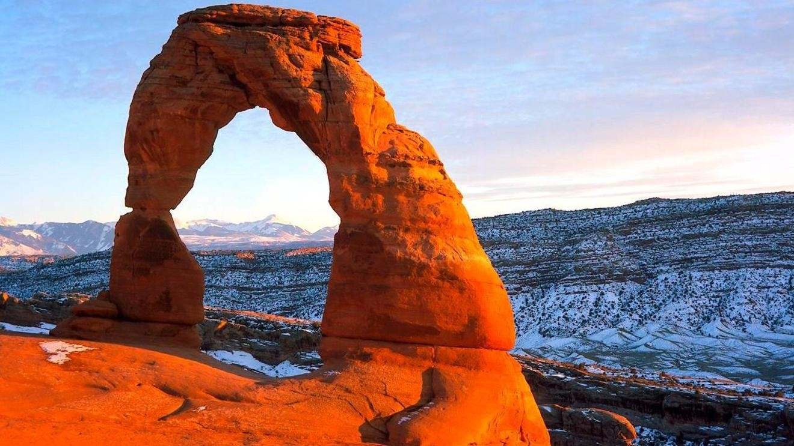

I first came to Utah as a tourist in 2002 with my ex  girlfriend.  She convinced me while having a beer at the Bunyan Room at Loon Mountain in Lincoln, NH that I should change my yearly trip to Colorado to a trip to Utah.  

"Is there good skiing there?"

"Um, yeah, the best snow you will ever ski."

Hmm, All I knew was the winter olympics were there, Moab was famous for mountain biking, and the Mormons ran everything.  

A loud, abrasive cohort at Loon proudly bumped into the conversation: "I hear you need to go to Wyoming for beer and there are no bars or nightclubs. Stick with Breckenridge man, at least there is a nightlife. The skiing isn't better there."

Katie, my ex, is a very smart woman. She went to law school at the University of Utah and knew a thing or two about skiing in Utah. I listened to her instead of the drunk friend and two months later we were staying in Bear Hollow in sleepy, shoulder season Park City.  Ironically the same place I bought a condo in almost 20 years later. 

I would love to say I fell in love with Utah immediately but I didn't.  It was early April and Park City was not what it is now.  The whole town was in shoulder season mode.  The Olympics just finished and everyone there was sort of catching their breaths after the event.  I remember it was the same weekend Elizabeth Smart was found after being abducted by a crazy homeless religious zealot.  We drove into Salt Lake City to see the sights, the church, the tabernacle choir, the spectacle of the press conference where this sweet innocent girl was reunited with her family.  

Utah was just surreal. Strange culture and a small quiet city.  The mountains looming over the city were breathtaking and distracted me from driving.  It still is just as breathtaking and I try to never take it for granted.

Katie broke her arm at Loon two weeks before the trip and so she couldn't ski with me. She would drop me off at Solitude or Brighton or Snowbird and meet me later.  The whole trip felt weird and Katie, rightfully so, was still pissed that I selfishly downplayed her injury when it happened.  Despite all the misgivings there was something about this little state that I found compelling. 

A year later I convinced other friends from Loon to go on vacation with me in Park City. We skied at all the resorts and checked out the town. Park City was still slow mid week during the season. Main street was kind of dead and there was not much happening. I was single and ready to mingle.  With whom I have no idea as there were just no single women to interact with in Park City.  We all figured venturing into Salt Lake was pointless because the headquarters of the LDS church was in the center of SLC and therefore it was Vatican City and nothing to do but pray.   Ironically when we stayed in Dillon CO we drove about the same distance to Breckenridge but we stayed away from SLC.  We came back after a couple of good powder days but nobody was really gung ho about the place. We returned after our second trip in agreement that Utah was cool but kinda weird. Good snow but still nothing great.  We had yet to experience the Greatest Snow on Earth on a legit Utah powder day. 

It wasn't until a year later that my friend Curtis and I were watching the weather in the Rockies that I recommended a trip to Utah.  His brother owned a huge mansion that he rented out in Silverthorn, CO that we would take advantage of when nobody was renting it.  We changed our plans and flew into Utah on a Tuesday night.  Because both of us were self employed we could go on these spur of the moment trips.   We got a room at a Motel 6 right on 600s in Salt Lake. It was the first trip where something felt different. We nailed the weather pattern and the next day we were driving our front wheel drive chevy rental up Big Cottonwood intended for Brighton. We couldn't get past Solitude because of the snow so we decided to ride there instead. This was before IKON and Epic and Utah was still weird and unknown. There was no line at all in Big Cottonwood.  No red snake to contend with driving up. We didn't get stopped at the bottom for driving a front wheel drive vehicle with no traction devices. We were arrogant and young and dumb and figured "hey it's not even snowing in the canyon and it's only 14 miles. How bad could it be up there?"

We skied Solitude that day and pretty much lost our minds. It was deep and untracked all day.  We were dumbfounded and fell in love with the mountains of Utah.  

"Where is everyone?"

This snow is  amazing! I've never been in anything like this?"

But mostly it was : "WOOOOOOTTTT !!  WHOAAA!!!!! WTF!!!!"

 That night we went out to a bar called Port-O-Call in Salt Lake and discovered really hot, really nice Utah women.  We were in heaven.  

We both kept saying to each other "Why are we not living here?"  Every day of that trip we met amazing, kind people. We met locals the sponsored us at the bar since you still needed to be a member in those days.  Mostly we found deep snow and nobody around to get it.  

Heaven.

We came back a few times together until I moved to Utah in 2006.  Curtis passed away in 2019 from cancer.  He is and always will be my brother and I miss him dearly.  He reminds me to not ever stop living the best life I can.  

Since I moved in 2006 I watched this little quiet state turn into an IKON / Epic pass destination.  I watched the housing market crash in 2008 and then explosively rebound with the help of IT jobs and giant tech companies moving in on cheap land and cheap labor.  Now, Utah is not what it was 15 years ago.   Traffic has congested LCC and BCC to the point where locals are fed up with it. We backcountry ski to avoid lift lines.  We drive over an hour away from our home resorts to different mountains yet untouched  by the IKON Epic visitors just to get away and get some solace.  

I miss the old Utah.   Progress, greed and overpopulation has turned it into Colorado.  We haven't learned a thing from their predicament. Sadly Utah cannot handle the crowds and this once secret gem is now a secret no more.  Pandoras Box has been opened and there's nothing any of us can do about it.  Finding the next destination a little further out is the plan, most of us grumble.  But we don't want to lose our precious Greatest Snow on Earth and many of us, including me, are still grasping on with both hands.  

The world revolves and we must adapt.