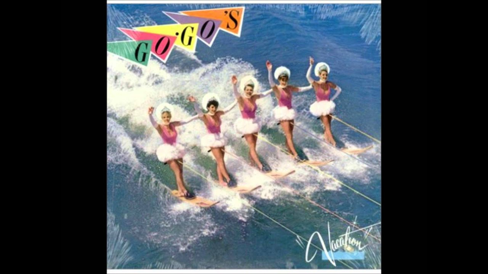

Finally took a week off at the end of the ski season. 

Here I am, my head spinning, various injuries nagging me, age creeping in, a new job looming on the horizon and lots of PTO to use up at my current spot.  I try to take this time to try and breathe, center myself but It always feels like it's fleeting and the time goes way too fast.  

I have house work to do, yard work to do, plants that need love, a fence that needs mending, a heart and soul that is drained and ground down from the day to day running around, failed relationships, and working remotely from my home office alone for over a year.  

I have caught myself using age as an excuse for things: "I can't stay up late anymore",  "I can't drink like I used to", "I'm too old to do tricks on skis".

I have come to realize in my Covid induced hermitage that these excuses are part of a bigger picture. They are really me saying, "I don't care about impressing you, or FOMO, or what your version of me is."  

For my whole life I was stuck in a cycle of trying to impress people. To live in the spotlight. To turn attention to me.  Always looking forward and not living in the moment.  Fear of Missing Out of the party, of the bar, of the event.  

Turns out, you ain't missing much at the club, staying up late only makes you miss the mountain sunrise and first turns at the mountain, going a bit slower lets you really enjoy the turns and see the view.  

So today I choose to relax a bit.  Live in the Now.  Breathe.  Take in some meditation.  Enjoy every sip of that coffee.   Get my hands dirty, make the world a bit more beautiful...starting with my weed infested yard.