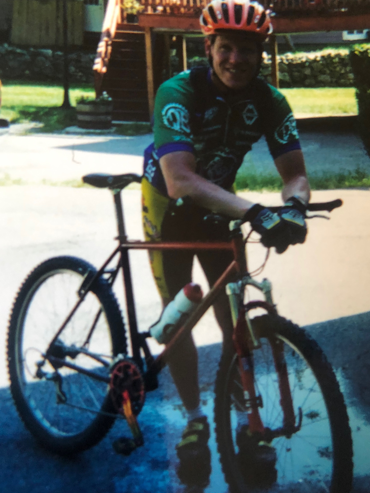
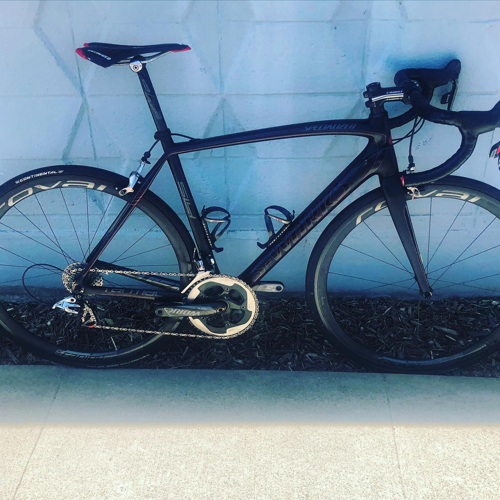
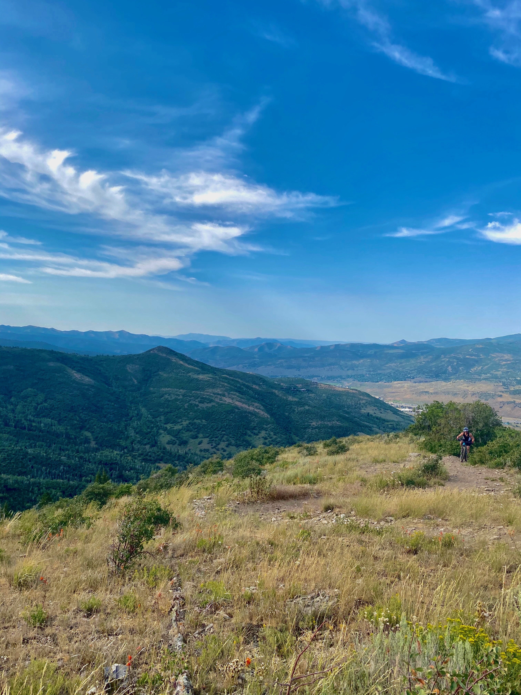

Why do some of us get our kicks on the masochism of a hill climb?  There is no adrenaline rush, no belly butterflies, just slow moving pain.  You take every rock, root and switchback at a time.  You slowly suffer while pondering life choices, watching your breathing and heart rate, figuring out what gear to be in for that short steep punchy section that is coming around the next switchback.  Sometimes your hands go numb and your neck hurts.  Sometimes your feet don't want to be in your bike shoes, sometimes your watch or phone dies and you (gasp!) can't record your ride on Strava. 

 For the past several years I have jumped into downhill mountain biking with both feet.  The joys are ever present: big jumps, huge man made berms,  steep technical trails, bikes that can take any punishment you throw at them.  The confidence you get on a full squish, slacked out monster while wearing pads and a full face helmet is simply amazing.  With the exception of catching a perfect wave or untracked backcountry powder, a downhill trail with the right bike and friends is the most fun you an have with your pants on. 

As a consequence of my new addiction I stopped riding my road bike.  I stopped going on group road rides sponsored by some local bike store or group, and started hanging out with guys who love to bike shuttle, hate the climb, drink lots of beer, make fun of roadies and consider spandex really bad fashion and only to be worn under another layer of baggy shorts.  

### Humble Beginnings

I got my first mountain bike in 1991 and was instantly hooked. No helmet, no padded shorts or special shoes.  I would ride trails at Borderland State Park in Easton,MA and learned the hard way about clipless pedals and the need for padded shorts.  Like many parks in the 1990s, all of the trails were designed as hiking trails.  Nobody envisioned bikes being able to go anywhere but the road and BMX tracks.  Borderland has trails that are downright abusive:  Full of rocks and roots and drops and tight trees. The old addage :"if you aint bleedin' you didn't ride" definitely applied there.  To me, that was mountain biking.  Heavy hard tail klunker 26ers usually breaking after three rides.  It was heaven. 

### Race Time

I did my first race in 1996: the Spring Boogie in Cumberland Rhode Island sponsored by The Eastern Fat Tire Association (EFTA)  .I showed up late, missed the beginner class and jumped into sport class.   No warm up, no clue what to do, or how long it would take.  Like most races I participated in in New England it was muddy, drizzling, full of roots, and badly marked.    One lap was 6 miles, sport did 3 laps.  I jumped out of the gate sprinting, my old Polar heart rate monitor screaming at me to slow down.  

I made it one lap and crawled to my car with my tail between my legs.  The whole experience was insane and overwhelming to me.    The race involved two water crossings so deep you could lose your bike.  So much mud you were running through muck half the time instead of riding, and technical enough that I went over the bars twice.  I thought I was fit. I was a young, cocky, personal trainer in Boston who taught spinning classes and thought I knew cycling.

I was determined to do it again. I came back the next year and raced beginner class and won. I then won a couple more and moved back up into sport class that year. 

 My first sport class race, the Hillsboro Classic in New Hampshire, was a 32 mile slogfest.  I went all out and bought an Independent Fabrications steel hardtail bike literally 2 days before the race. It was the most money I've ever spent at one time that wasn't a car.  I loved that bike. It was a bare bones 26er, super light and responsive. Made right in Boston. 

Of course another lesson to learn with mountain bike racing: You probably should ride the bike before committing to a 32 mile technical race.  I had no balance or control, didn't know where my gears where and crashed like 10 times.  I finished in 3 plus hours in the middle of a huge pack (Sport Senior Men was the biggest group in most races).  I doubled my efforts, rode the road bike up any hill i could.  Rode with groups and teams and weighed my food.  Bought books on training and dieting for endurance athletes and started winning.  For a few years I thought I was going places.  I moved through the ranks to expert and semi-pro and successfully got my ass handed to me on a regular basis by the pros.  I was out of my league and could not compete.  I never contemplated drugs or cheating. I just couldn't taint the experience.  As I got into my 30s I realized my window was closing and I went back to graduate school.  Two years later with an MS degree from Bentley University I decided to leave New England for Utah and the rest is history.

### Back on the Bike

Today was the first day I rode my new road bike.  I just purchased a Specialized S-Works Tarmac carbon.  The bike weighs 15 pounds soaking wet and climbs like a beast.  My old bike: a 2001 Cannondale R-2000 Si was top of the game in 2000. I upgraded the components to the top of the line Campagnolo Record and thought i was a pretty big deal.  Since then alot has changed: I got older, i slowed down, major back surgery too late caused me to lose use of my big toe on my left side which created all types of weird things happening with muscle synchronicity and performance. 

 I moved to Utah where the climbs are long and painful. 

